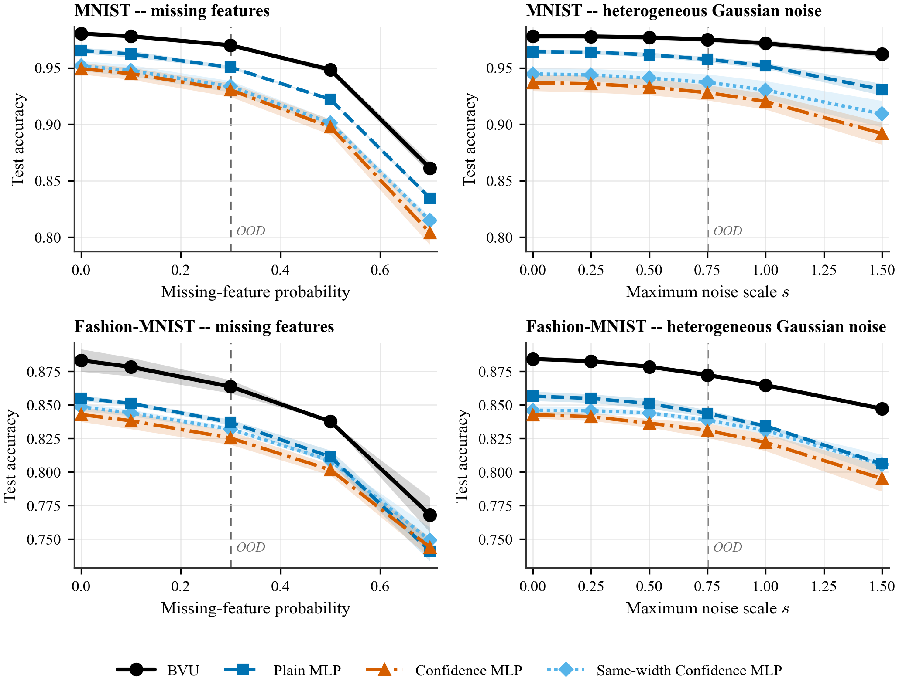
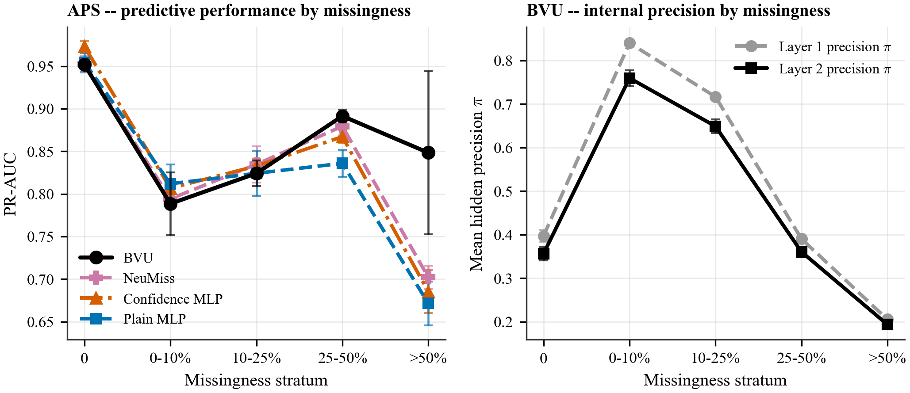
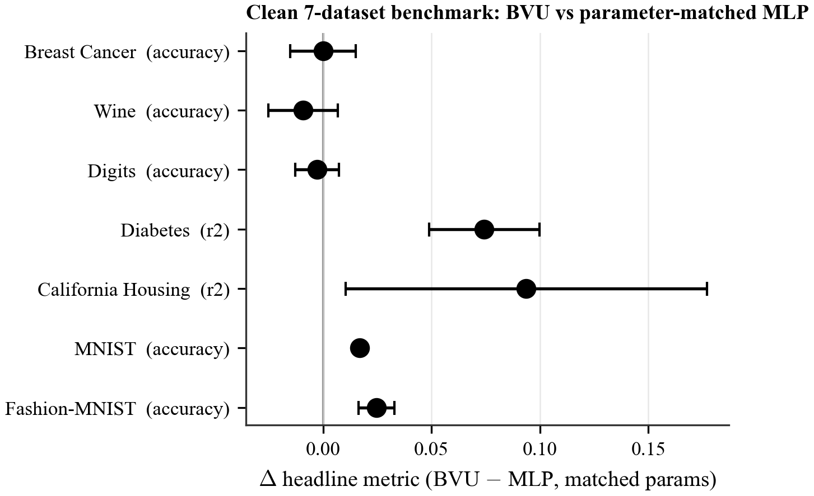

# Paper A -- figure generation report

Generated 2026-09-17 against repo commit `b0fec63` (branch
`cellv03_nano_transformer`), from **frozen** Paper-A Phase-2/Phase-3
processed run records. This was a visualization-only pass: no experiment
was re-run, no result file, model, or benchmark was modified. Regenerate
with:

```bash
python paper/figures/make_fig2_controlled_corruption.py
python paper/figures/make_fig3_aps_missingness_mechanism.py
python paper/figures/supplementary/make_figS1_clean_benchmarks.py
python paper/figures/lib/validate.py   # or: pytest tests/test_paper_a_figures.py
```

All three scripts are deterministic (verified by running each twice and
diffing the exported CSV's content hash -- see
`tests/test_paper_a_figures.py::test_fig{2,3}_regenerates_deterministically`).

> **Naming.** The model is displayed as **BVU** everywhere in figures and tables. Its internal family id in the frozen run records and code is still `cellv0.3` (e.g. `phase1_cellv03_runs.json`, `family == "cellv0.3"`); ids were not changed so every figure stays a pure function of the frozen result files.

## Source files used

| Figure | Source file(s) | Rows used |
|---|---|---|
| Fig 2 (Phase-2 curves: BVU, Plain MLP, Confidence MLP) | `experiments/paper_a/reliability/results/processed/reliability_runs.json` | 96 total; 24 rows used (2 datasets x 2 corruptions x 3 families x 3 seeds) |
| Fig 2 (Phase-3 curve: Same-width Confidence MLP) | `experiments/paper_a/reliability/results/processed/capacity_stress_runs.json` | 18 total; 12 rows used (2 datasets x 2 corruptions x 3 seeds) |
| Fig 3 (both panels, APS only) | `experiments/paper_a/real_reliability/results/processed/real_reliability_runs.json` | 36 total; 12 rows used for the left panel (4 families x 3 seeds); the same 3 BVU rows reused for the right panel's `belief_by_stratum` |
| Fig S1 (supplementary) | `experiments/paper_a/results/processed/phase1_cellv03_runs.json` (BVU, 21 of 42 rows: 7 datasets x 3 seeds @ train_fraction=1.0) + `phase1_runs_small.json` / `phase1_runs_mid.json` / `phase1_runs_mnist_1.0.json` / `phase1_runs_fashion_mnist_1.0.json` (`mlp_matched` arm, same 21-row shape) | 42 rows |

These are the processed `--summary-out` exports written by each
experiment's own run script at the time it ran (`run_reliability.py`,
`capacity_stress.py`, `run_real_reliability.py`, `run_phase1_v03.py`,
`run_phase1.py`) -- not reconstructed from the committed Markdown tables.
Raw per-run `RunRecord` JSON (`results/raw/*.json`, gitignored) file counts
were cross-checked and are consistent with these processed exports (e.g.
228 raw files under `reliability/results/raw/` = (96 + 18) runs x 2 files/run
[main + `_history`, no dedup collisions]; 66 raw files under
`real_reliability/results/raw/` = 30 neural runs x 2 files + 6 HGB runs x 1
file, HGB has no training history). Frozen-status confirmed in
`docs/research_log.md` (2026-09-09 "Paper A Phase 2" / "Paper A Phase 3"
entries) and the phase README files
(`experiments/paper_a/reliability/README.md`,
`experiments/paper_a/real_reliability/README.md`).

## Aggregation procedure

1. Load the processed JSON export for each source (never the raw
   per-replica/history files directly).
2. **Reject duplicates**: assert each (dataset, corruption_family/none,
   family, seed) key appears exactly once per source file.
3. For Fig 2, at each frozen test severity, read `sweep.severities[i].metrics`
   -- already the mean over that severity's 3 deterministic corruption
   replicas (verified against `replica_metrics` with an explicit
   invariant check, tolerance 1e-6 relative) -- then take mean/sample-std
   **across the 3 seeds**.
4. For Fig 3 left panel, read `evaluation.by_stratum[bin].pr_auc` per seed,
   mean/std across seeds per bin; a bin with zero valid seed values would
   be dropped rather than interpolated (none occurred for APS -- all 5
   bins are populated for all 4 plotted families, min bin size 114 test
   examples).
5. For Fig 3 right panel, same procedure over
   `evaluation.belief_by_stratum[bin].{l1,l2}_pi_mean`, BVU only.
6. For Fig S1, pair BVU and the recorded `mlp_matched` arm by seed
   within each dataset at `train_fraction=1.0`, take the per-seed
   difference, then mean/sample-std of that paired difference across
   seeds.
7. No significance testing anywhere (n=3 seeds), matching every committed
   Paper-A report.

All aggregated values are re-exported to
`fig2_controlled_corruption_data.csv` / `fig3_aps_missingness_mechanism_data.csv`
/ `supplementary/figS1_clean_benchmarks_data.csv` so every plotted number
can be independently re-derived without opening a PDF.

## Figure dimensions

| Figure | Size (inches) | Layout |
|---|---|---|
| Fig 2 | 7.1 x 5.3 | 2x2 panels, one shared legend below |
| Fig 3 | 7.1 x 3.2 | 1x2 panels, per-panel legend |
| Fig S1 (supplementary) | 4.6 x 3.2 | single panel, forest/dot-error-bar plot |

## Plotted models

| Figure | Models |
|---|---|
| Fig 2 | BVU, Plain MLP, Confidence MLP, Same-width Confidence MLP |
| Fig 3 left | BVU, NeuMiss, Confidence MLP, Plain MLP |
| Fig 3 right | BVU only (layer 1 / layer 2 internal precision) |
| Fig S1 | BVU vs. MLP (parameter-matched), as a paired delta |

One fixed color/marker/linestyle identity per model is defined once in
`paper/figures/lib/style.py` and reused unchanged across Fig 2 and Fig 3
(BVU is always black/solid/circle; Plain MLP always blue/dashed/square;
Confidence MLP always vermillion/dash-dot/triangle). Okabe-Ito
colorblind-safe palette; every curve is also distinguishable by
marker + linestyle alone (grayscale-safe).

## Seed counts

Every plotted (dataset, corruption_family or bin, model) cell in Fig 2 and
Fig 3 has exactly **3** seeds (0, 1, 2) -- verified by
`lib/validate.py::check_seed_counts` / `tests/test_paper_a_figures.py`.
Fig S1 likewise pairs exactly 3 seeds per dataset.

## Warnings / missing values

- **None.** No missing severities, no missing APS missingness bins (all 5
  frozen bins -- `0`, `(0, 0.10]`, `(0.10, 0.25]`, `(0.25, 0.50]`, `>0.50`
  -- are populated for every family plotted in Fig 3), no dropped points,
  no divergence/NaN records among the rows used (cross-checked against
  each phase's own "Failures and caveats" section: `reliability_results.md`
  and `publication_validation_results.md` both report "Divergence / NaNs:
  none" for every cell used here).
- California Housing / Digits and the HistGradientBoosting reference are
  present in the underlying processed records but are **out of scope for
  Fig 2 / Fig 3** per the task spec (main figure restricted to MNIST /
  Fashion-MNIST and to the 4 named model curves; HGB has no
  `by_stratum` breakdown recorded and was not requested for Fig 3).
- Fig 3's right-panel precision curve is **not monotonic** in missingness
  (rises from the fully-observed bin to the lowest-missingness bin, then
  falls) -- flagged explicitly in `captions.md` rather than smoothed over
  or asserted away.

## Output paths

```
paper/figures/fig2_controlled_corruption.pdf
paper/figures/fig2_controlled_corruption.png
paper/figures/fig2_controlled_corruption_data.csv
paper/figures/fig3_aps_missingness_mechanism.pdf
paper/figures/fig3_aps_missingness_mechanism.png
paper/figures/fig3_aps_missingness_mechanism_data.csv
paper/figures/captions.md
paper/figures/figure_generation_report.md   (this file)
paper/figures/supplementary/figS1_clean_benchmarks.pdf
paper/figures/supplementary/figS1_clean_benchmarks.png
paper/figures/supplementary/figS1_clean_benchmarks_data.csv
paper/figures/lib/{style,data,validate}.py  (shared infrastructure)
tests/test_paper_a_figures.py               (pytest wrapper on lib/validate.py)
```

## Preview






